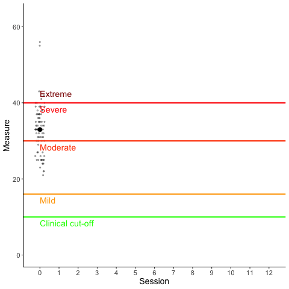

# txanimate: Tools to animate change processes during treatment

A random collection of some ideas to bring data alive, make dots fly around to make things more exciting.
Might be useful for conference presentations so that the audience doesn't fall asleep half way through the talk.

## Idea 1: Two groups

## Idea 2: Clinical cut-offs

